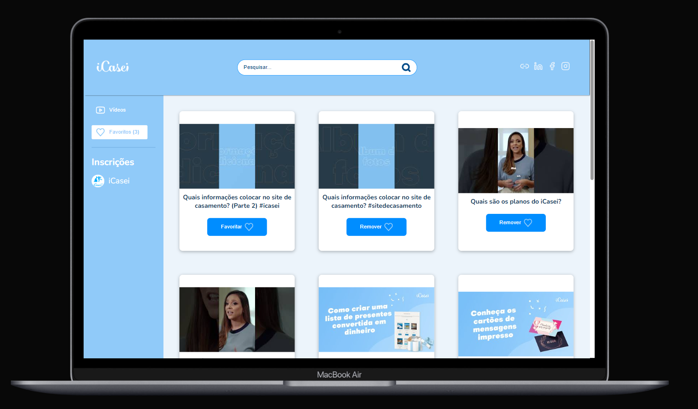
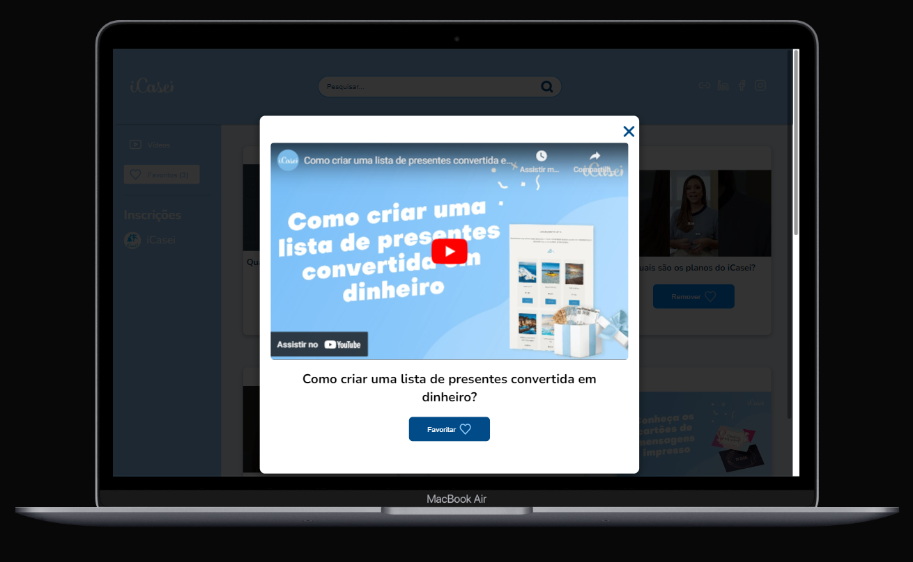
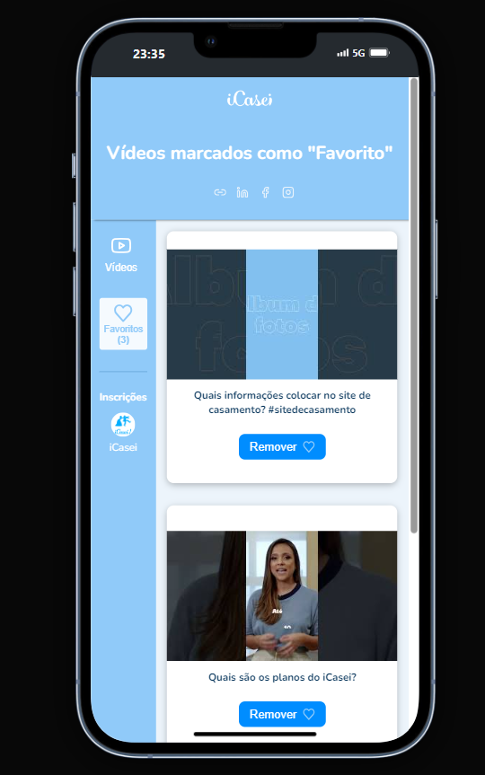

# iCasei Video Player ▶️

Este projeto permite buscar vídeos do canal do iCasei no YouTube, reproduzir os vídeos diretamente na página utilizando o player do YouTube, e adicionar vídeos aos favoritos para acesso rápido.

## Funcionalidades
Busca de Vídeos: Permite buscar vídeos utilizando a API do YouTube.
Exibição de Vídeos: Mostra os vídeos mais recentes do canal iCasei.
Favoritos: Permite marcar vídeos como favoritos, armazenando essa informação localmente.
Player de Vídeo: Permite reproduzir vídeos diretamente no site utilizando o iframe do YouTube.
Interface Responsiva: Design responsivo para uma experiência consistente em diferentes dispositivos.

 

### Demonstração desktop:

### Player de Vídeo com botão favoritar/remover:

### Mobile:

### Tecnologias utilizadas:
- HTML
- CSS
- JS

#
